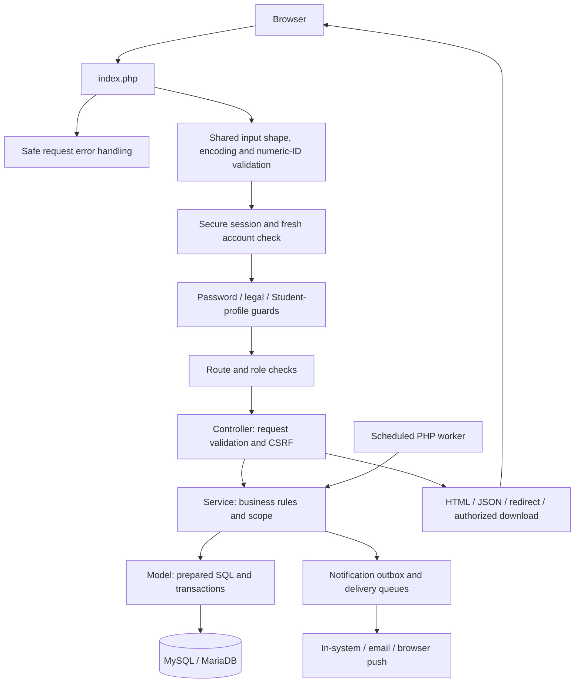
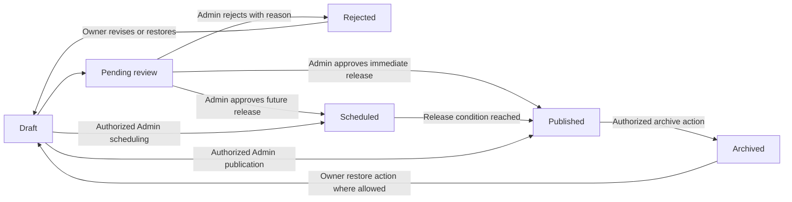

> Evaluation-pack snapshot prepared 6 October 2026. Read [current state](CURRENT-STATE.md) first; original verification dates and limitations below remain applicable. Relative source-code links require the project repository.

# OLSHCO Digital Hub - System Evaluation Guide

Version 1.1 - 2 October 2026 - Technical reference for IT evaluators and maintainers

This guide describes the implemented system and connects evaluation claims to source, schema and existing test evidence. It is documentation, not an independent certification or a production deployment approval. Historical test results are distinguished from the unexecuted manual evaluation checklist.

## Documentation set

| Document | Use |
| --- | --- |
| [User manual](user-manual.md) | Separate task instructions for Admin, Faculty, Student and Parent. |
| [Database reference](database-reference.md) | All 65 tables, 624 columns, indexes and 125 declared foreign-key constraints. |
| Physical ER source (local only: `database-schema.mmd`) | Complete Mermaid diagram, including all tables and declared relationships. |
| System diagrams (local only: `system-diagrams.md`) | DFD context/level 1, role use cases and UML class/sequence/state diagrams, with editable sources. |
| [Route reference](routes-reference.md) | Complete front-controller registry and implementation pointers. |
| [Evaluation checklist](evaluation-checklist.md) | Repeatable role-based, security, browser and operational acceptance scenarios. |
| [Test catalog](../../tests/README.md) | Automated suites, dependencies and fixture side effects. |
| [Deployment configuration](deployment-configuration.md) | Runtime, configuration files, hosting and installation requirements. |

## Parent registration update

The [account-independent child verification extension](parent-registration-verification.md) adds a second Parent registration path, Admin enrollment/relationship verification, revocation, and later linking. Migration 029 was applied locally on 26 September 2026; the observed baseline now has 65 tables. The separate user manual documents both paths. Root `pages/` files are active; `config/pages/` copies are legacy.

## 1. System overview

### Purpose and objectives

The Digital Hub centralizes school information and controlled content publication. Its objectives are to provide relevant information to eligible recipients; let Faculty prepare scoped content for Administrator review; track permitted engagement; collect structured survey/profile information with access boundaries; and support accountable operation through notifications, history and reporting.

These are functional objectives, not measured claims of improved school performance. Evaluation should measure whether each workflow and restriction behaves as documented, using the checklist and recorded results.

### Scope

Implemented domains include public school information; Student/Parent registration and account approval; Faculty provisioning; account access and recovery; academic structure; announcement/event/document/content-survey authoring; review, publication, scheduling and archiving; recipient targeting; unified engagement; in-system/email/browser notifications; Student profile questionnaires and update cycles; government-advisory intake/review/conversion; dashboards, staff reports and audit history.

The application is not documented as a full enrollment, grading, attendance, payment or learning-management system. Guest is an unauthenticated state, not one of the four authenticated account roles.

### Current limitations and release status

- Hosting/TLS topology and public URL are not finalized. Production cookie/proxy validation and unattended worker configuration remain pending.
- The original schema plus migrations 027/028/029/030 defines the current 65-table expectation. A scratch-only bootstrap rehearsal is not a general production installer or completed production seed/Administrator provisioning.
- Unknown routes return HTTP 404 using the shared themed HTML/JSON error renderer. Status-specific standalone designs are not required for each status.
- Contact inquiries now send directly through SMTP to sapinjanfortun1@gmail.com (6 October update), with validation, CSRF/form-token protection and rate limiting. No durable inquiry storage/retry queue is provided; SMTP acceptance is not final inbox receipt. Contact links remain fallback methods.
- The main workspace totals are uncapped, while displayed content lists still have per-type caps. A count larger than the visible list is not proof of missing records.
- Automated tests are focused checks. Full browser, accessibility, load, real delivery and full database/uploads restore acceptance must be recorded separately.
- Survey small-group suppression reduces disclosure risk; free text and repeated observation can still identify people. It is not an anonymity guarantee.
- Old folder READMEs and preserved legacy tables can describe earlier architecture. Use current controllers/models and this dated documentation set.

## Latest verified changes

The [2 October re-audit](deployment-re-audit-2026-10-02.md) fixes malformed authentication inputs, numeric-ID coercion, nested rich-text sanitization, duplicate unknown-route fallback, malformed browser-push payloads and arbitrary push destinations. Validation preserves legitimate password/text content; server-side business and authorization rules still apply. Push endpoints are limited to supported providers and keys validated before storage. No application rows or schema were changed by those fixes.

System diagrams (local only: `system-diagrams.md`) provide the current ERD, DFD context/level 1, role use cases and UML class, sequence and state models. Database metadata was refreshed read-only on 2 October: 65 tables, 624 columns and 125 foreign keys, including Faculty onboarding nullability from migration 030.

## 2. Architecture and request flow



[index.php](../../index.php) is the browser front controller. Controllers read HTTP/session input, enforce method/CSRF/role checks and select responses. Services implement workflow, ownership, eligibility and validation. Models access MySQLi connections. Server-rendered pages receive view data; JavaScript enhances selected interactions. Normal survey participation remains a native form submission.

The main shell uses [sidebar.php](../../include/sidebar.php); authentication pages use a minimal shell. Shared styling follows [root.css](../../Assets/css/root.css), layout styles and existing components. There is no requirement for a separate JavaScript asset on every page.

### Trust boundaries

Untrusted boundaries include query/form values, uploaded files, browser headers, cookies, externally fetched advisory pages and recipient-provided text. Role, ownership, target eligibility and workflow decisions must not rely on hidden buttons alone. Document paths are resolved through authorized delivery. The server controls HTTPS detection; arbitrary forwarded headers are not trusted.

The configuration boundary includes database credentials, application key, canonical URL, SMTP settings and VAPID keys. Keep them outside source control and public artifacts. `OLSHCO_APP_KEY` supports recovery verification and rate-limit HMAC keys; rotating it affects outstanding recovery tokens and limiter buckets.

### Global guard behavior

A fresh account check can revoke stale/inactive/changed-role sessions. Password change precedes legal re-consent; a required Student-profile cycle follows. The three requirements retain their remediation/save/logout allowlists. JSON routes or AJAX headers receive safe JSON codes and local next-page destinations; normal navigation retains redirects. Page authentication and role failures are also request-aware. See [global-guard evidence](global-guards-verification.md).

### Transactions and asynchronous work

Content/targets and publication notification intent are committed together through [PublicationTransaction](../../app/services/PublicationTransaction.php). The outbox prevents a successful publication from losing all notification work merely because immediate dispatch fails. Delivery uses leases/retries and deduplication. A successful database commit, queue entry and external delivery receipt are different stages and should be evaluated separately.

Registration commits the account, legal acceptances and Parent link as appropriate within its transaction. A failure must roll back partial account creation. Rate limits are checked before application transactions and commit their counters independently; rolling back a rejected business action does not erase its attempt count.

## 3. Database and information model

The [database reference](database-reference.md) is the complete schema dictionary. It was generated from metadata, not personal application records. The ER diagram represents declared SQL constraints; polymorphic content IDs and other service-enforced relationships are identified separately rather than presented as nonexistent foreign keys.

| Domain | Main entities and relationships |
| --- | --- |
| Identity and governance | `user` → `role` and academic assignments; `parent_student` verifies Parent–Student links; role/status/audit histories record governed changes. |
| Academics | `department`, `education_level`, `academic_program`, `grade_level`, `section`, with catalog-change history. |
| Content | `announcements`, `events`, `documents`, `survey`, per-type targets, topic catalog/assignments and release metadata. |
| Unified engagement | `content_view`, `content_reaction`, `content_comment`, `content_acknowledgment`; references to multiple content types are partly application-enforced. |
| Content surveys | Survey → questions/choices → response → answers/selected choices. |
| Student profiles | Profiles, interests, versioned questions, consent, responses, cycles, scopes and per-Student assignments. |
| Notification delivery | `notification`, preferences, `publication_notification_outbox`, `email_delivery`, `push_subscription`, `push_delivery`. |
| Security/legal | Reset requests/tokens, rate counters, versioned legal documents and acceptance records. |
| Advisory/calendar | Government sources, rules and reviewed advisories; calendar holiday definitions. |
| Retained history | Legacy announcement-specific engagement remains in the schema; it is not the active engagement architecture. |

The original 62-table snapshot remains immutable. Additive baselines 027, 028 and 029 cover the notification outbox, request rate limits and account-independent child records. The read-only baseline checker compares columns, indexes, constraints, engine and collation while ignoring row-dependent next AUTO_INCREMENT counters. A matching schema does not establish correct seed data or record integrity.

## 4. Permissions and workflows

### Permission matrix

“Eligible” requires current account state and recipient/relationship rules. “Own” includes workflow restrictions. This matrix summarizes access, not an instruction to infer Administrator access to every Faculty-only screen.

| Capability | Guest | Student | Parent | Faculty | Admin |
| --- | --- | --- | --- | --- | --- |
| Public information | Yes | Yes | Yes | Yes | Yes |
| Information Hub / engagement | No | Eligible | Eligible through verified links | Eligible | Authorized access |
| Public registration | Student/Parent only | — | — | No Faculty self-registration | No Admin self-registration |
| Own account photo | No | Yes | Yes | Yes | Yes |
| Own Student interests/profile | No | Yes | No private child response access | No Student self-service | No Student self-service |
| Create/manage school content | No | No | No | Own, assigned scope | Governance/authorized authoring |
| Approve/reject publication | No | No | No | No | Yes |
| Survey results | No | No | No | Owned survey | Yes; suppression still applies |
| Department Analytics/report/preview | No | No | No | Assigned department | Controller is Faculty-only |
| Dashboard/export | No | No | No | No | Yes |
| Account approvals/manage users | No | No | No | No | Yes |
| Academic/profile-cycle/advisory management | No | No | No | No | Yes |

The front controller classifies Department Analytics as a staff route, but [DepartmentAnalyticsController](../../app/controllers/DepartmentAnalyticsController.php) explicitly requires Faculty. Administrators use Dashboard reporting. This distinction was verified during documentation rather than assuming a universal Admin bypass.

### Account lifecycle

Student/Parent registration validates personal/academic/link information and legal acceptance. New accounts await approval; Parent linkage requires verification. Administrators provision Faculty with a temporary password and explicit academic scope. Status/role changes are governed and recorded. Active-session account checks invalidate access when credentials, status or role no longer match.

### Faculty targeting

College Faculty are limited to their assigned division, education level and program, optionally narrowed to valid year/section. IBED Faculty are limited to their assigned division and education level, optionally narrowed within that level. Elementary, Junior High and Senior High are not interchangeable scopes. Administrators can use schoolwide/custom role and academic targets. Incomplete/inactive assignments fail closed. See [scope evidence](faculty-scope-verification.md).

### Content lifecycle



This is a conceptual workflow diagram. Exact per-type/status checks remain in the controllers/models. “Restored” is an action returning content to Draft, not an extra SQL workflow state invented for documentation. Faculty cannot approve or publish their own submission directly. A scheduled/calendar release remains subject to approval and a working release process.

### Surveys and Student profiles

Content surveys use publication/targeting plus opening/closing rules and duplicate-response protection. Results are restricted to authorized staff and five-person suppression at survey, answered-question and small-choice-group levels, with no Admin exemption.

Student-profile questionnaires are distinct: Draft-only question editing, versioned answers/consent, cycle preview/activation/closure and per-Student assignments. Supported cycle scopes are All Active Students, College Students and IBED Students. Required operational questions and optional sensitive-consent handling are different decisions. Completing a profile cycle is not the same operation as submitting a content survey.

### Notifications and government advisories

Preferences determine channel/category eligibility; delivery queues and deduplication protect notification behavior. The combined worker handles due publishing/reminders and delivery. An advisory is reviewed and can become an announcement draft; intake alone does not publish raw government content schoolwide.

## 5. Security and privacy controls

| Control | Implemented evidence | Boundary / limitation |
| --- | --- | --- |
| Credential/session handling | [Session report](session-security-verification.md), [AuthService](../../app/services/AuthService.php), [security helpers](../../config/security.php) | Cookie Secure depends on trusted web-server HTTPS state; verify the actual host. |
| CSRF/method/role checks | [BaseController](../../app/controllers/BaseController.php), endpoint controllers, [content-access tests](content-access-verification.md) | Test direct requests and denied actors, not just hidden controls. |
| Account and request abuse limits | [Abuse-protection report](abuse-protection-verification.md) | Shared NAT/proxy IPs share limits; distributed traffic still needs infrastructure protection. |
| Upload and download protection | [Upload report](document-upload-verification.md), [download controller](../../app/controllers/DocumentDownloadController.php) | Format validation is not antivirus scanning or proof a document is harmless. |
| Survey privacy | [Survey privacy report](survey-privacy-verification.md) | Underlying individual records remain sensitive; free text may identify its author. |
| Safe errors | [Request-error report](request-error-verification.md) | PHP cannot handle server startup errors before the entry point; some routes intentionally use plain text/redirects. |
| Publication reliability | [Outbox report](publication-notification-readiness.md) | Queue/retry success is not proof of received SMTP/push delivery. |
| Secrets/configuration | [Deployment guide](deployment-configuration.md) | Private files must be excluded from public release packages and backed up securely. |

Current limiter policies: login 120 attempts/IP/15 minutes and 20/normalized identifier/15 minutes, plus the existing five-failure/15-minute account lock; registration 30/IP/hour; engagement per user/minute: open 120, react 60, comment/reply 10, acknowledgment 60. Recovery separately limits three requests/identifier and ten/IP per 15 minutes; recovery links expire after 30 minutes.

Rate counters store scoped HMAC identifiers, attempts and expiry rather than raw email/IP values. Cleanup is bounded and request-driven, not a global storage cap. Request handlers provide 429 and Retry-After. The current fixed-window design permits bursts around boundaries and has not been load-certified.

The shared error renderer provides a themed page and safe JSON, including HTTP 404 for unknown routes and 422 for malformed fields. Responses do not expose internal traces; references help support locate logged failures.

Privacy evaluation must also examine who can access database backups, exports, logs, profile answers and push subscriptions. Retention periods, authorized support access and school policy approval require institutional decisions; no invented retention schedule or legal certification is asserted here.

## 6. Testing evidence and reproducibility

### Evidence levels

- **Source/schema verified:** inspected current code or metadata; this does not equal a browser test.
- **Automated evidence:** a named suite passed when recorded in its dated report; coverage is limited to its assertions and fixtures.
- **Manual acceptance:** an evaluator actually performed the checklist case and recorded result/evidence.
- **Deployment acceptance:** a check performed against the chosen host, real delivery configuration or isolated recovery environment.

The manual checklist starts **Not run**, even where a related automated suite exists. It is an assessment form, not fabricated test results. Record commit/release identity plus dirty-tree state because a commit alone may not describe the current local application.

### Existing automated suites

Run from the project root in a controlled local/staging environment. Substitute `C:/xampp/php/php.exe` when PHP is not on PATH. Each suite is independent; review [tests/README.md](../../tests/README.md) before running it. Fixtures may need PHP CGI, temporary-table privileges, an existing readable document, Node, XAMPP Apache or Windows scripting.

| Command | Previously recorded result | Evidence |
| --- | --- | --- |
| `php tests/content_access.php` | 124 checks | [Content access](content-access-verification.md) |
| `php tests/content_access_http.php` | 95 checks | [Content access](content-access-verification.md) |
| `php tests/faculty_scope.php` | 158 checks | [Faculty scope](faculty-scope-verification.md) |
| `php tests/faculty_scope_http.php` | 37 checks | [Faculty scope](faculty-scope-verification.md) |
| `node tests/faculty_scope_ui.js` | 15 checks | [Faculty scope](faculty-scope-verification.md) |
| `php tests/session_security.php` | 35 checks | [Session security](session-security-verification.md) |
| `php tests/session_security_http.php` | 105 checks | [Global guards](global-guards-verification.md) |
| `php tests/survey_privacy.php` | 166 checks | [Survey privacy](survey-privacy-verification.md) |
| `php tests/publication_durability.php` | 74 checks | [Publication durability](publication-notification-readiness.md) |
| `php tests/publication_outbox_schema.php` | 14 checks | [Publication durability](publication-notification-readiness.md) |
| `php tests/request_errors_http.php` | 79 checks | [Request errors](request-error-verification.md) |
| `php tests/document_upload_http.php` | 125 checks | [Uploads](document-upload-verification.md) |
| `php tests/upload_directory_http.php` | 68 checks | [Uploads](document-upload-verification.md) |
| `php tests/deployment_configuration.php` | 34 checks | [Configuration](deployment-configuration.md) |
| `php tests/request_performance.php` | 101 checks | [Performance](request-performance-verification.md) |
| `php tests/workspace_counts.php` | 37 checks | [Workspace counts](workspace-counts-verification.md) |
| `php tests/scheduler_monitoring.php` | 33 checks (2026-10-01) | [Scheduler](scheduler-monitoring.md) |
| `php tests/abuse_protection.php` | 53 checks | [Abuse protection](abuse-protection-verification.md) |
| `php tests/abuse_protection_http.php` | 84 checks | [Abuse protection](abuse-protection-verification.md) |
| `php tests/global_guards_http.php` | 195 checks (2026-10-01) | [Global guards](global-guards-verification.md) |
| `php tests/profile_cycle_lifecycle.php` | 29 checks (2026-10-01) | Activation, partial saving, completion, closing, forged assignment/version IDs, and response preservation; temporary tables only |
| `php tests/profile_cycle_notifications.php` | 14 checks (2026-10-01) | Missing-reminder recovery, deduplication, eligible recipients, preferences and survey destination; no external delivery |
| `php tests/question_identifiers.php` | 10 checks (2026-10-01) | Automatic identifiers, immutable edit identity and Draft restrictions; in-memory model |
| `php tests/student_guard_writes.php` | 16 checks (2026-10-01) | Required-survey state and future/closed cycle handling; temporary tables only |
| `php tests/database_baseline.php` | 12 checks | [Baseline](database-baseline-readiness.md) |

The table contains historical subsystem evidence. The 2 October re-audit completed 47 passing suites and 220 passing syntax checks; see [current suite results](../deployment-audit-results.json) and [audit scope](deployment-re-audit-2026-10-02.md). Manual acceptance and real delivery remain separate. Additional configuration/bootstrap tests and their specific prerequisites are described in the test catalog. The fresh-install test targets only the named scratch database and rolls back its data; do not retarget it to production.

A focused example run:

```powershell
php scripts/check_deployment_configuration.php
php scripts/check_database_baseline.php
php tests/global_guards_http.php
php tests/abuse_protection.php
php tests/abuse_protection_http.php
```

Save command, exit code, date, environment and output with the evaluation record. A successful suite normally prints PASS. Record fixture/environment failures separately from application defects; do not hide failed cases in an aggregate score.

## 7. Installation, operation and recovery

### Requirements and preparation

[composer.json](../../composer.json) requires PHP `^8.2` (compatible PHP 8.x starting at 8.2). Use the lockfile and `composer install`, not an unreviewed dependency upgrade. Run `composer check-platform-reqs`. PHP extension requirements include MySQLi, fileinfo, mbstring, OpenSSL, cURL, DOM/libxml, Phar and sessions; verify web and CLI environments independently.

The current verified workstation uses XAMPP and `olshcodb`. Provision development/staging separately from production. Review [configuration](deployment-configuration.md), [schema baseline](database-baseline-readiness.md) and [bootstrap rehearsal](fresh-install-bootstrap.md) before installation. The snapshot contains destructive DROP statements and is not safe to import over populated data. Historical migrations are not a demonstrated replay-all installer.

Production database settings come from OLSHCO_DB_* variables with OLSHCO_APP_ENV=production; the runtime rejects root/blank-password production settings. Supply the stable OLSHCO_APP_KEY and canonical HTTPS OLSHCO_APP_URL. SMTP/VAPID configuration currently uses private configuration files as documented, not an assumed dotenv loader. Provision the reviewed academic/legal/reference catalog and initial Administrator through an approved setup procedure; no default credentials are documented.

### Release checklist

1. Freeze and identify the actual release files, including intended untracked files; review changes and exclude secrets, dumps, archives, tests/development artifacts from the public package.
2. Back up database, uploads and required private configuration through the operator's approved process. Confirm a tested recovery point before schema upgrades.
3. Prepare the database baseline plus approved additive migrations 027, 028, 029 and 030 using migration credentials. Verify all 65 expected definitions with the read-only checker; verify reference data separately.
4. Configure HTTPS, trusted proxy/client-IP behavior, private logs/session storage and upload access rules. Match CLI/web timezone and database scheduling expectations.
5. Configure the worker under the chosen service identity and environment. Confirm only the intended registration runs and inspect exit/log/queue state.
6. Use staging accounts to execute the checklist and actual email/push delivery checks. Confirm external cookie flags, direct-download restrictions and denial of private directories.
7. Obtain release approval and a documented rollback/recovery decision. Passing local tests is not this approval.

### Worker operation

The combined worker [dispatch_browser_push.php](../../scripts/dispatch_browser_push.php) handles due publication, notification retries, reminders, email and push. It can change records and deliver messages. It is not a read-only diagnostic command.

The local Windows task `OLSHCO Digital Hub Worker` was observed enabled on a one-minute schedule; its duplicate was disabled. The hidden launcher waits for PHP and propagates exit status. Exit 0 means no reported stage failure and a written summary; 1 means failure, 2 launcher/prelaunch failure, and 75 overlapping-run skip. Counts and queue state are also necessary. The current interactive identity requires the local user to be logged in; choose an appropriate unattended production arrangement separately.

Inspect Task Scheduler, the private worker log and queue state without manually dispatching real messages as a test. See [scheduler monitoring](scheduler-monitoring.md) for exact inspection commands and [outbox behavior](publication-notification-readiness.md) for leases/retries. Do not clear queues to hide failures.

### Backup and isolated recovery procedure

This is an operator runbook to be approved/executed in the target environment, not a claim that a full recovery exercise already passed.

1. Record release identity, database engine/version, schema baseline, storage paths, timezone and worker configuration. Agree the recovery-point and recovery-time objectives with the school; none are measured yet.
2. Coordinate a consistent backup window. Quiesce application writes and workers, or use a verified transaction-consistent database backup plus a coordinated upload snapshot. A schema-only dump is insufficient.
3. Capture database data/schema (including constraints and any deployed routines/triggers/events), uploaded files and the matching release. Back up required secrets/configuration separately with restricted encrypted access. Do not put passwords on command lines or into evaluation documents.
4. Record backup time, artifact checksums, storage location and access owner. Test readability and retain according to approved school policy; do not invent or silently apply retention periods.
5. Restore into a new isolated database and storage location using the matching software/runtime. Disable external deliveries and automatic worker execution in the recovery environment before opening the app.
6. Verify schema, reference catalogs, controlled account sign-in, roles, legal acceptances, content targets/workflows, profile histories, survey privacy, file references and representative file checksums. Check that restored worker state does not cause unreviewed duplicate deliveries.
7. Record measured recovery duration and recoverable data age. Compare with the agreed objectives; record failures and repeat the rehearsal after fixes.
8. Only an approved cutover may repoint the public application and re-enable delivery. Keep the previous state available for the reviewed rollback plan. Do not run blanket database drops or queue resets.

Full recovery verification and production backup automation are outstanding operational acceptance items. Source-file backups made during development are not substitutes for database/uploads recovery.

## 8. Evaluation method and sign-off

Use the [checklist](evaluation-checklist.md) with separate Admin, Faculty, Student and Parent sessions and representative academic assignments. Each case requires expected behavior, observed result, evidence ID, evaluator and date. Test denied paths by direct requests as well as the visible UI. Use synthetic data for sensitive profiles and small-group surveys.

Assess functional correctness, access/privacy, usability/accessibility, reliability, performance and maintainability. These are project evaluation categories, not a declaration of compliance with an external standard. If the institution has a scoring rubric, attach it without relabeling untested cases as passed.

Block release on unauthorized data access, credentials/personal data disclosure, broken critical registration/publication/submission flows, unrecoverable partial writes, or missing required deployment controls. Record lesser usability/maintenance findings with severity, owner and follow-up date. Host-specific configuration, installation/restore rehearsal, real delivery and manual role acceptance remain open; unknown-route handling was fixed in the 2 October re-audit.

The documentation is complete as a review package. Evaluator signatures, actual browser results and deployment/recovery outcomes must be supplied by the people performing those activities; this guide does not fabricate them.

See the [2 October deployment launch checklist](deployment-launch-checklist.md) for the current verified checkpoint, hosting requirements, and remaining launch gates.
